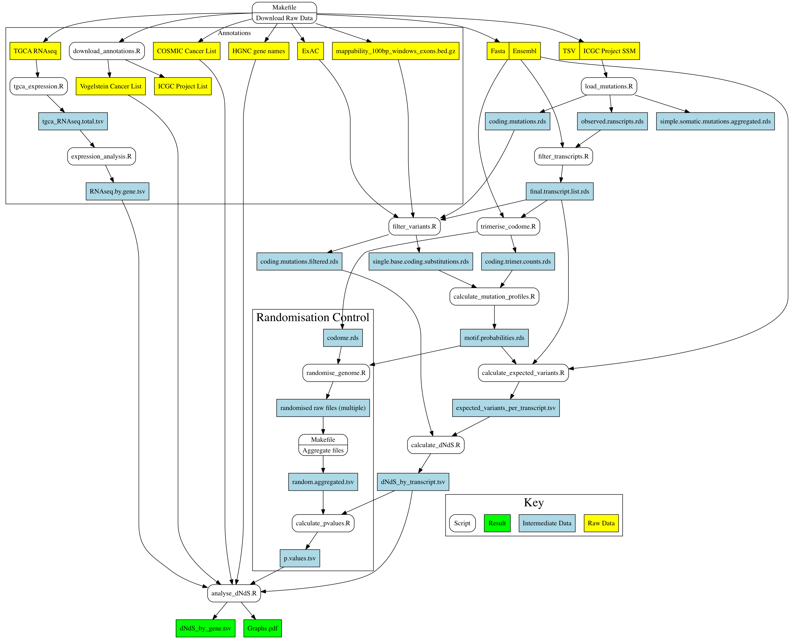

# Ludwig
Looking for negative selection in cancer genomes - DPhil rotation project with Benjamin Schuster-Böckler at the Ludwig Institute for Cancer Reasearch at the University of Oxford

## Installation
The Makefile should automatically download the raw data, analyse it and output the results:
```
git clone --depth 1 https://github.com/daniel-wells/Ludwig.git
cd Ludwig
make
```

## Data Flow Diagram


Cache files are generated on the first run of the script. If you want these files to be remade, rename / move / delete the current file. Make will not automatically remake the cache files.

## Dependencies
- Python 2.6.6 (r266:84292)
- R 3.2.2
  - data.table 1.9.6
  - ggplot2 2.0.0
  - metRology 0.9-17
  - ggrepel 0.4
  - Bioconductor
    - SomaticSignatures
    - BSgenome.Hsapiens.UCSC.hg19
- GNU Make 3.81
- git 2.5.4
- graphviz 2.38.0 (20140413.2041) (dot for creating data flow diagram)

## Hardware Requirements
This code was designed for use on a machine with at least 64GB of RAM and 50GB of avaliable disk space.

## Licence