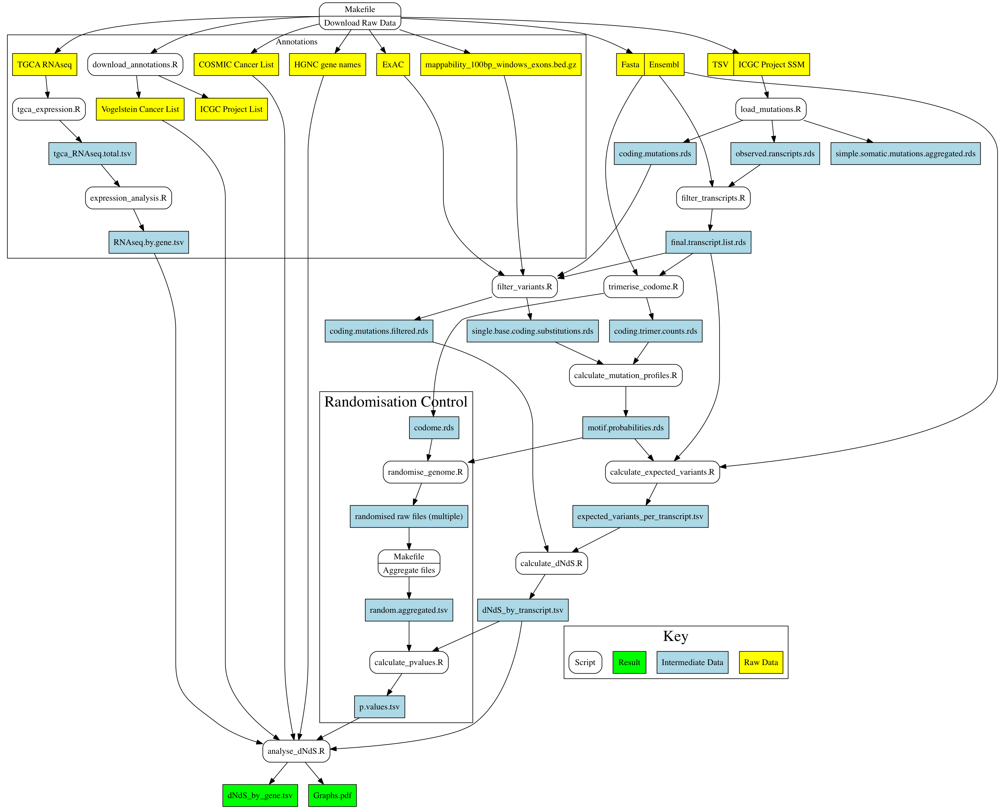

# A ratiometric method for detecting somatic selection in cancer
This code takes somatic mutation data from the [International Cancer Genome Consortium](ICGC.org) and for each gene calculates the ratio of nonsynonymous to synonymous mutations (normalised by codon composition etc.). Positively selected genes (cancer driver genes) will have a large ratio, negatively selected genes (essential genes / non-oncogene addiction genes) will have a small ratio. For a more detailed description refer to the [manuscript](https://doi.org/).

By Daniel Wells and Benjamin Schuster-Böckler at the [Ludwig Institute](http://www.ludwig.ox.ac.uk/benjamin-schuster-boeckler-group-page) for Cancer Reasearch, University of Oxford

## Installation
First ensure all [dependencies](README.md#Dependencies) are installed and loaded.
Then download the code and download the ICGC project list:
```bash
curl https://github.com/daniel-wells/somatic-selection/archive/master.zip -o somatic-selection.zip
unzip somatic-selection.zip
# alternatively: git clone --depth 1 https://github.com/daniel-wells/somatic-selection.git
cd somatic-selection
Rscript code/download_ICGC_list.R
```

Due to licencing constraints and poor programmatic data accessibility the Cosmic Cancer Gene Census needs to be downloaded manually before running the method. The download requires [registration](https://cancer.sanger.ac.uk/cosmic/register) and can be completed as follows:
```bash
sftp "registration.email.address@example.com"@sftp-cancer.sanger.ac.uk
# enter password now
get /files/grch38/cosmic/v77/cancer_gene_census.csv cancer_gene_census.csv
```
"cancer_gene_census.csv" should now be in the same directory as the Makefile.

The file '/mnt/lustre/users/bschuster/TCGA/Coverage/mappability_100bp_windows_exons.bed.gz' is a 100bp sliding window of mappability for all exonic positions and was created from [wgEncodeCrgMapabilityAlign50mer.bigWig](http://hgdownload.cse.ucsc.edu/goldenPath/hg19/encodeDCC/wgEncodeMapability/wgEncodeCrgMapabilityAlign50mer.bigWig) using bedtools and then converted using bigWigToBedGraph. Resulting in a 451M file with the following format:
```
chr1    11769   0.139
chr1    11770   0.139
chr1    11771   0.139
```
For now the script just copies this local copy to the project directory.

Then proceed to run the method (~3 hours):
```bash
make
```

Results can be found in the 'results' directory which will be automatically created. If anything goes wrong then look through the files in the 'logs' directory for errors.

## Data Flow Diagram


Note that the randomisaton control and the expression (RNAseq) annotations do not run automatically.

## Dependencies
- GNU Make 3.81
- R 3.2.2
  - data.table 1.9.6
  - jsonlite (converting ICGC project list)
  - gdata (Excell spreadsheet conversion)
  - ggplot2 2.0.0 (plotting graphs)
  - ggrepel 0.4 (labeling graphs)
  - Bioconductor: SomaticSignatures (calculating mutaiton profiles)
  - Bioconductor: BSgenome.Hsapiens.UCSC.hg19 (")
- bcftools 1.0 (for processing ExAC)

Optional (for creating data flow diagram):
- Python 2.6.6 (r266:84292)
- graphviz 2.38.0 (20140413.2041) (dot for creating data flow diagram)

## Hardware Requirements
This code was designed for use on a machine with at least 64GB of RAM and 30GB of avaliable disk space. ~9GB of raw data will be downloaded for the analysis.

## Licence
This software is licenced under the MIT licence, see [LICENSE.md](LICENSE.md) for further details.
